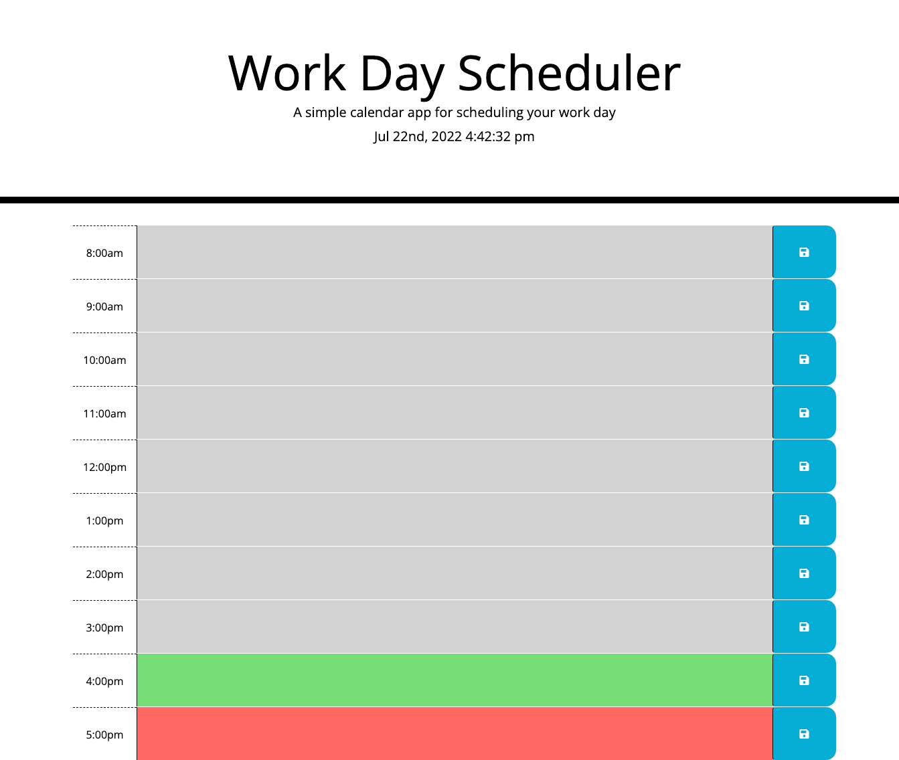

# work-day-planner
By Dana Golebiewski

## Description 

A work day scheduler that will save your information in hour long time blocks. The color of the blocks will change with the current time - grey for the past, green for the current time, and red for the future.

## Built With 

HTML and CSS starter code, and JavaScript and JQuery. 

## Link to final version 

[Site Link]/(https://danagolebiewski.github.io/work-day-planner/)

## Website Preview 

